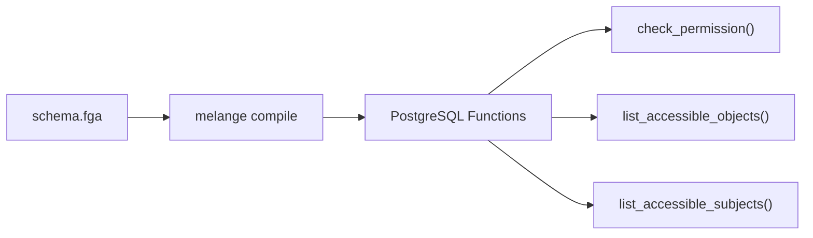

<div class="homepage-hero">


  <div class="hx:w-2 hx:h-2 hx:rounded-full hx:bg-primary-400"></div>
  <span>Free, open source</span>
  


<div class="hx:mt-6 hx:mb-6">

  Zanzibar-Style Authorization&nbsp;<br class="hx:sm:block hx:hidden" />for PostgreSQL

</div>

<div class="hx:mb-12">

  Implement fine-grained, relationship-based access control without external services.&nbsp;<br class="hx:sm:block hx:hidden" />Melange compiles OpenFGA schemas into SQL functions that run inside your existing database.

</div>

<div class="hx:mb-6 hx:flex hx:gap-4">


</div>

</div>


  
  
  
  
  
  


<div class="homepage-section-gap"></div>

<div class="homepage-columns">
<div>


  How It Works


<div class="hx:mt-6"></div>

<div class="content">

Melange is an **authorization compiler**. Like Protocol Buffers or GraphQL Code Generator, you define a schema and Melange generates optimized code tailored to your exact model. Instead of a generic runtime that interprets your model at query time, Melange generates **purpose-built SQL functions** for each relation in your schema. Role hierarchies are resolved at compile time and inlined into SQL, so runtime checks avoid recursive graph traversal entirely.

</div>
</div>
<div>



</div>
</div>

<div class="homepage-section-gap"></div>

<!-- Define Your Schema: 2-column -->
<div class="homepage-columns">
<div>


  Define Your Schema


<div class="hx:mt-6"></div>

<div class="content">

Write your authorization model using the OpenFGA DSL. The same `.fga` files work with both Melange and OpenFGA, so there's no vendor lock-in.

Melange supports direct assignments, computed usersets, unions, intersections, exclusions, tuple-to-userset, wildcards, userset references, and contextual tuples.

</div>
</div>
<div class="content">

```fga
model
  schema 1.1

type user

type organization
  relations
    define owner: [user]
    define admin: [user] or owner
    define member: [user] or admin

type repository
  relations
    define org: [organization]
    define owner: [user]
    define admin: [user] or owner
    define can_read: member from org or admin
    define can_write: admin
    define can_delete: owner
```

</div>
</div>

<div class="homepage-section-gap"></div>

<!-- Query Your Existing Tables: 2-column -->
<div class="homepage-columns">
<div>


  Query Your Existing Tables


<div class="hx:mt-6"></div>

<div class="content">

Unlike traditional FGA systems, Melange doesn't need a separate tuple store. Create a SQL view that maps your existing domain tables into tuples, and Melange queries them directly.

No data duplication. No sync jobs. Permissions are always consistent with your domain data, down to the current transaction.

</div>
</div>
<div class="content">

```sql
CREATE VIEW melange_tuples AS
-- Organization memberships
SELECT
    'user' AS subject_type,
    user_id::text AS subject_id,
    role AS relation,
    'organization' AS object_type,
    organization_id::text AS object_id
FROM organization_members

UNION ALL

-- Repository ownership
SELECT
    'organization' AS subject_type,
    organization_id::text AS subject_id,
    'org' AS relation,
    'repository' AS object_type,
    id::text AS object_id
FROM repositories;
```

</div>
</div>

<div class="homepage-section-gap"></div>

<!-- Check Permissions: 2-column -->
<div class="homepage-columns">
<div>


  Check Permissions From Any Language


<div class="hx:mt-6"></div>

<div class="content">

Once compiled, permission checks are simple SQL function calls. Use the Go or TypeScript client libraries for convenience, or call the generated functions directly from any language that can talk to PostgreSQL.

</div>
</div>
<div class="content">




```go
checker := melange.NewChecker(db)

allowed, err := checker.Check(ctx,
    authz.User("alice"),
    authz.RelCanRead,
    authz.Repository("123"),
)
```



```typescript
const checker = new Checker(pool);

const decision = await checker.check(
  User('alice'),
  RelCanRead,
  Repository('123'),
);
```



```sql
SELECT check_permission(
  'user', 'alice',
  'can_read',
  'repository', '123'
);
-- Returns 1 (allowed) or 0 (denied)
```




</div>
</div>

<div class="homepage-section-gap"></div>

<div class="homepage-cta">


  Get Started in Minutes


<div class="hx:mt-6"></div>

<div class="content">

```bash
# Install
brew install pthm/tap/melange

# Initialize your project
melange init

# Apply schema and generate SQL functions
melange migrate

# Generate type-safe client code
melange generate client
```

</div>

<div class="homepage-cta-buttons">


</div>

</div>
