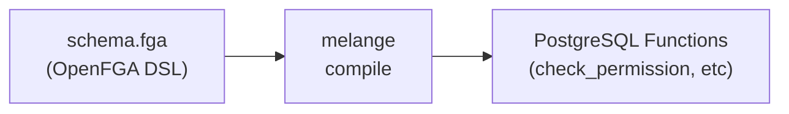

Melange is an **OpenFGA-to-PostgreSQL compiler**. It takes your authorization model (written in OpenFGA DSL) and compiles it into specialized PostgreSQL functions that run permission checks directly inside your database.

## What is an Authorization Compiler?

If you've used [Protocol Buffers](https://protobuf.dev/), [GraphQL Code Generator](https://the-guild.dev/graphql/codegen), or similar tools, you're familiar with the pattern: define a schema, run a compiler, get optimized code tailored to your exact definitions.

Melange applies this pattern to authorization:

Instead of a generic runtime that interprets your model at query time, Melange generates **purpose-built SQL functions** for each relation in your schema. The result is authorization logic that runs as native PostgreSQL code, with all the benefits that brings: transaction awareness, query planning, and zero network hops.

## How It Works

1. **Define your model** - Write an OpenFGA schema (`.fga` file) describing types, relations, and permission rules
2. **Compile to SQL** - Run `melange migrate` to generate and install specialized PostgreSQL functions
3. **Query permissions** - Call the generated functions from any language or directly in SQL

Read more about Melange's architecture and how it works [here](concepts/how-it-works).

## Why Compile to PostgreSQL?

| Traditional FGA | Melange |
|----------------|---------|
| Separate authorization service | Authorization lives in your database |
| Network round-trip for every check | Single SQL query |
| Eventual consistency with your data | Transaction-aware, always consistent |
| Generic graph traversal at runtime | Specialized functions per relation |
| Sync tuples to external store | Query your existing tables directly |

## Key Features

- **Specialized Code Generation** - Each relation gets its own optimized check function, not a generic interpreter
- **Works with Your Tables** - Permissions derived from a view over your existing data (no tuple sync)
- **Transaction Aware** - Permission checks see uncommitted changes within the same transaction
- **Language Agnostic** - Generated SQL functions callable from Go, Python, Node.js, or any PostgreSQL client
- **OpenFGA Compatible** - Use familiar OpenFGA DSL syntax for authorization models

## Quick Start


  


## Concepts

Understand the core architecture and design of Melange.


  
  
  


## Client Libraries

Melange includes client libraries for convenient access to the generated SQL functions. For direct SQL access from any language, see the [SQL API reference](reference/sql-api).


  
  
  


## Reference

Technical reference documentation.


  
  
  
  


## Contributing


  

