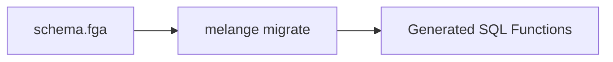

Melange is an **OpenFGA-compatible authorization library** that runs entirely in **PostgreSQL**. Unlike traditional FGA implementations that perform graph traversal in application code, Melange generates specialized SQL functions that execute permission checks directly in the database.

## Architecture Overview

Melange operates in two distinct phases:

1. **Build Time (Migration)**: Parses your OpenFGA schema and generates optimized SQL functions
2. **Runtime**: Permission checks execute as single SQL queries against your existing data

### Build Time



### Runtime


## Specialized SQL Function Generation

The key insight behind Melange's performance is **specialization**. Instead of a single generic permission-checking function that must handle all possible schema patterns, Melange generates purpose-built functions for each relation in your schema.

### What Gets Generated

For a schema like:

```fga
model
  schema 1.1

type user

type folder
  relations
    define owner: [user]
    define viewer: [user] or owner

type document
  relations
    define parent: [folder]
    define owner: [user]
    define editor: [user] or owner
    define viewer: [user] or editor or viewer from parent
```

Melange generates:

| Function                  | Purpose                                                           |
| ------------------------- | ----------------------------------------------------------------- |
| `check_folder_owner()`    | Direct tuple lookup for folder owners                             |
| `check_folder_viewer()`   | Union check: direct assignment OR implied by owner                |
| `check_document_owner()`  | Direct tuple lookup for document owners                           |
| `check_document_editor()` | Union check: direct assignment OR implied by owner                |
| `check_document_viewer()` | Complex check: direct, editor hierarchy, AND parent folder access |
| `check_permission()`      | Dispatcher that routes to specialized functions                   |

### Template-Based Generation

Each function is generated from templates optimized for specific authorization patterns:

- **Direct assignment** (`[user]`): Simple `EXISTS` check against tuples
- **Role hierarchy** (`viewer: owner`): Precomputed closure lookup
- **Union** (`[user] or owner`): OR'd `EXISTS` clauses
- **Tuple-to-userset** (`viewer from parent`): Recursive lookup via parent objects
- **Exclusion** (`but not blocked`): Access check with exclusion condition
- **Intersection** (`writer and editor`): All conditions must be satisfied

### Example Generated Function

For `document.viewer: [user] or editor or viewer from parent`, Melange generates:

```sql
CREATE OR REPLACE FUNCTION check_document_viewer(
  p_subject_type TEXT,
  p_subject_id TEXT,
  p_object_id TEXT,
  p_visited TEXT[] DEFAULT ARRAY[]::TEXT[]
) RETURNS INTEGER AS $$
BEGIN
    -- Cycle detection for recursive patterns
    IF p_object_id = ANY(p_visited) THEN
        RETURN 0;
    END IF;

    -- Direct assignment or implied by editor hierarchy
    IF EXISTS(
        SELECT 1 FROM melange_tuples t
        WHERE t.object_type = 'document'
          AND t.object_id = p_object_id
          AND t.relation IN ('viewer', 'editor', 'owner')
          AND t.subject_type = p_subject_type
          AND (t.subject_id = p_subject_id OR t.subject_id = '*')
    ) THEN
        RETURN 1;
    END IF;

    -- Tuple-to-userset: viewer from parent
    IF EXISTS(
        SELECT 1 FROM melange_tuples link
        WHERE link.object_type = 'document'
          AND link.object_id = p_object_id
          AND link.relation = 'parent'
          AND check_permission_internal(
              p_subject_type, p_subject_id,
              'viewer',
              link.subject_type,
              link.subject_id,
              array_append(p_visited, p_object_id)
          ) = 1
    ) THEN
        RETURN 1;
    END IF;

    RETURN 0;
END;
$$ LANGUAGE plpgsql STABLE;
```

## The Dispatcher Pattern

The `check_permission()` function acts as a router, dispatching to specialized functions based on the object type and relation:

```sql
CREATE OR REPLACE FUNCTION check_permission(
  p_subject_type TEXT,
  p_subject_id TEXT,
  p_relation TEXT,
  p_object_type TEXT,
  p_object_id TEXT
) RETURNS INTEGER AS $$
    SELECT CASE
        WHEN p_object_type = 'document' AND p_relation = 'viewer'
            THEN check_document_viewer(p_subject_type, p_subject_id, p_object_id)
        WHEN p_object_type = 'document' AND p_relation = 'editor'
            THEN check_document_editor(p_subject_type, p_subject_id, p_object_id)
        WHEN p_object_type = 'folder' AND p_relation = 'viewer'
            THEN check_folder_viewer(p_subject_type, p_subject_id, p_object_id)
        -- ... more cases
        ELSE 0  -- Unknown type/relation: deny by default
    END;
$$ LANGUAGE sql STABLE;
```

This eliminates runtime interpretation of the schema and allows PostgreSQL's query planner to optimize each specialized function independently.

## Precomputed Relation Closure

Role hierarchies like `owner -> admin -> member` are resolved at migration time, not runtime. Melange computes the transitive closure of implied-by relationships:

For a schema with:

```fga
define owner: [user]
define admin: [user] or owner
define member: [user] or admin
```

Melange precomputes:

| relation | satisfying_relation |
| -------- | ------------------- |
| member   | member              |
| member   | admin               |
| member   | owner               |
| admin    | admin               |
| admin    | owner               |
| owner    | owner               |

This closure is inlined directly into the generated SQL functions, so checking "does user have member?" becomes a simple `IN ('member', 'admin', 'owner')` clause rather than recursive function calls.

## The melange_tuples View

Melange reads authorization data from a view called `melange_tuples` that you define over your existing domain tables:

```sql
CREATE VIEW melange_tuples AS
-- Team memberships
SELECT 'user' AS subject_type,
       user_id::text AS subject_id,
       role AS relation,
       'folder' AS object_type,
       folder_id::text AS object_id
FROM folder_members

UNION ALL

-- Document -> Folder relationship
SELECT 'folder' AS subject_type,
       folder_id::text AS subject_id,
       'parent' AS relation,
       'document' AS object_type,
       id::text AS object_id
FROM documents;
```

This approach means:

- **Zero tuple sync**: No separate tuple storage to maintain
- **Transaction awareness**: Permission checks see uncommitted changes
- **Real-time consistency**: Tuples reflect current database state

## OpenFGA Schema Compatibility

Melange provides **full OpenFGA Schema 1.1 compatibility** (excluding conditions). The same `.fga` schema files work with both Melange and OpenFGA, continuously validated against the official OpenFGA test suite.





## Performance

Melange delivers sub-millisecond permission checks with **O(1) constant time scaling** — specialized SQL functions, precomputed closures, and in-database execution eliminate runtime overhead.





## Summary

Melange achieves its performance through:

1. **Build-time specialization**: Generating purpose-built SQL functions for each relation
2. **Precomputed closure**: Resolving role hierarchies before runtime
3. **View-based tuples**: Reading directly from your domain tables
4. **Pure SQL execution**: Leveraging PostgreSQL's query optimizer

This architecture delivers sub-millisecond permission checks while maintaining full OpenFGA Schema 1.1 compatibility, making it ideal for applications that need fine-grained authorization without the operational complexity of a separate authorization service.
