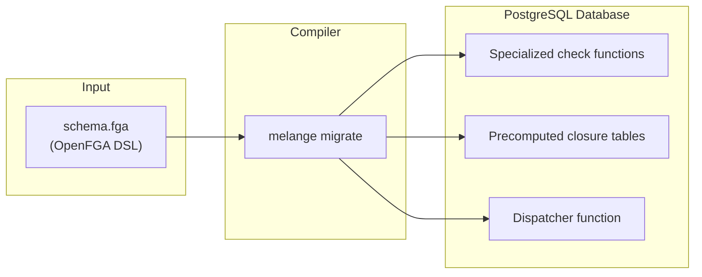

Melange is an **OpenFGA-to-PostgreSQL compiler**. It reads your authorization model and compiles it into specialized SQL functions that execute permission checks directly in your database — no external service, no network hops, no tuple synchronization.

## The Compiler Model

Like [Protocol Buffers](https://protobuf.dev/) compiles `.proto` files into language-specific serialization code, Melange compiles `.fga` files into PostgreSQL functions. The key difference from traditional FGA implementations is **when** the schema is processed:

| Approach | Schema Processing | Runtime Behavior |
|----------|-------------------|------------------|
| **Traditional FGA** | Interpreted at query time | Generic graph traversal |
| **Melange** | Compiled at migration time | Purpose-built SQL functions |

This compilation step is what enables Melange's performance — each relation in your schema gets its own optimized function, not a generic interpreter.

## Compilation Pipeline



### Compile Time

When you run `melange migrate`, the compiler:

1. **Parses** your OpenFGA schema
2. **Analyzes** relation patterns (direct, implied, union, intersection, etc.)
3. **Computes** the transitive closure of role hierarchies
4. **Generates** specialized SQL functions for each relation
5. **Installs** the functions into your PostgreSQL database

### Runtime

Permission checks are just SQL queries:

```sql
SELECT check_permission('user', 'alice', 'can_read', 'document', '123');
-- Returns 1 (allowed) or 0 (denied)
```

The generated functions query a `melange_tuples` view that you define over your existing domain tables — no separate tuple storage required.

## What the Compiler Generates

For a schema like:

```fga
model
  schema 1.1

type user

type folder
  relations
    define owner: [user]
    define viewer: [user] or owner

type document
  relations
    define parent: [folder]
    define owner: [user]
    define editor: [user] or owner
    define viewer: [user] or editor or viewer from parent
```

Melange compiles this into:

| Generated Function        | Purpose                                                           |
| ------------------------- | ----------------------------------------------------------------- |
| `check_folder_owner()`    | Direct tuple lookup for folder owners                             |
| `check_folder_viewer()`   | Union check: direct assignment OR implied by owner                |
| `check_document_owner()`  | Direct tuple lookup for document owners                           |
| `check_document_editor()` | Union check: direct assignment OR implied by owner                |
| `check_document_viewer()` | Complex check: direct, editor hierarchy, AND parent folder access |
| `check_permission()`      | Dispatcher that routes to specialized functions                   |

### Pattern-Specific Code Generation

The compiler recognizes authorization patterns and generates optimized code for each:

| Pattern | Schema Syntax | Generated Code |
|---------|--------------|----------------|
| Direct assignment | `[user]` | Simple `EXISTS` check |
| Role hierarchy | `viewer: owner` | Precomputed closure lookup |
| Union | `[user] or owner` | OR'd `EXISTS` clauses |
| Tuple-to-userset | `viewer from parent` | Recursive lookup via parent |
| Exclusion | `but not blocked` | Access check with exclusion |
| Intersection | `writer and editor` | All conditions must match |

### Example: Compiled Function

For `document.viewer: [user] or editor or viewer from parent`, the compiler generates:

```sql
CREATE OR REPLACE FUNCTION check_document_viewer(
  p_subject_type TEXT,
  p_subject_id TEXT,
  p_object_id TEXT,
  p_visited TEXT[] DEFAULT ARRAY[]::TEXT[]
) RETURNS INTEGER AS $$
BEGIN
    -- Cycle detection for recursive patterns
    IF p_object_id = ANY(p_visited) THEN
        RETURN 0;
    END IF;

    -- Direct assignment or implied by editor hierarchy
    IF EXISTS(
        SELECT 1 FROM melange_tuples t
        WHERE t.object_type = 'document'
          AND t.object_id = p_object_id
          AND t.relation IN ('viewer', 'editor', 'owner')
          AND t.subject_type = p_subject_type
          AND (t.subject_id = p_subject_id OR t.subject_id = '*')
    ) THEN
        RETURN 1;
    END IF;

    -- Tuple-to-userset: viewer from parent
    IF EXISTS(
        SELECT 1 FROM melange_tuples link
        WHERE link.object_type = 'document'
          AND link.object_id = p_object_id
          AND link.relation = 'parent'
          AND check_permission_internal(
              p_subject_type, p_subject_id,
              'viewer',
              link.subject_type,
              link.subject_id,
              array_append(p_visited, p_object_id)
          ) = 1
    ) THEN
        RETURN 1;
    END IF;

    RETURN 0;
END;
$$ LANGUAGE plpgsql STABLE;
```

Notice how the compiler has:
- Inlined the closure (`'viewer', 'editor', 'owner'`) rather than computing it at runtime
- Generated pattern-specific code for tuple-to-userset traversal
- Added cycle detection for recursive patterns

## The Dispatcher

The `check_permission()` function acts as a router, dispatching to the appropriate specialized function:

```sql
CREATE OR REPLACE FUNCTION check_permission(
  p_subject_type TEXT,
  p_subject_id TEXT,
  p_relation TEXT,
  p_object_type TEXT,
  p_object_id TEXT
) RETURNS INTEGER AS $$
    SELECT CASE
        WHEN p_object_type = 'document' AND p_relation = 'viewer'
            THEN check_document_viewer(p_subject_type, p_subject_id, p_object_id)
        WHEN p_object_type = 'document' AND p_relation = 'editor'
            THEN check_document_editor(p_subject_type, p_subject_id, p_object_id)
        WHEN p_object_type = 'folder' AND p_relation = 'viewer'
            THEN check_folder_viewer(p_subject_type, p_subject_id, p_object_id)
        -- ... more cases
        ELSE 0  -- Unknown type/relation: deny by default
    END;
$$ LANGUAGE sql STABLE;
```

This eliminates runtime schema interpretation and allows PostgreSQL's query planner to optimize each specialized function independently.

## Precomputed Relation Closure

Role hierarchies are resolved at compile time, not runtime. For a schema with:

```fga
define owner: [user]
define admin: [user] or owner
define member: [user] or admin
```

The compiler precomputes the transitive closure:

| relation | satisfying_relation |
| -------- | ------------------- |
| member   | member              |
| member   | admin               |
| member   | owner               |
| admin    | admin               |
| admin    | owner               |
| owner    | owner               |

This closure is inlined directly into the generated SQL. Checking "does user have member?" becomes a simple `IN ('member', 'admin', 'owner')` clause rather than recursive function calls.

## The melange_tuples View

Melange reads authorization data from a view you define over your existing tables:

```sql
CREATE VIEW melange_tuples AS
-- Team memberships
SELECT 'user' AS subject_type,
       user_id::text AS subject_id,
       role AS relation,
       'folder' AS object_type,
       folder_id::text AS object_id
FROM folder_members

UNION ALL

-- Document -> Folder relationship
SELECT 'folder' AS subject_type,
       folder_id::text AS subject_id,
       'parent' AS relation,
       'document' AS object_type,
       id::text AS object_id
FROM documents;
```

This approach means:

- **Zero tuple sync**: No separate tuple storage to maintain
- **Transaction awareness**: Permission checks see uncommitted changes
- **Real-time consistency**: Tuples always reflect current database state

See [Tuples View](./tuples-view.md) for detailed guidance on mapping your domain tables.

## OpenFGA Compatibility

Melange provides **full OpenFGA Schema 1.1 compatibility** (excluding conditions). The same `.fga` schema files work with both Melange and OpenFGA, continuously validated against the official OpenFGA test suite.





## Performance

Compiled SQL functions deliver fast permission checks (typically 300-600 μs) with **O(1) constant time scaling** — specialization, precomputed closures, and in-database execution eliminate runtime overhead.





## Summary

Melange's compiler architecture delivers performance through:

1. **Compile-time specialization**: Purpose-built SQL functions for each relation
2. **Precomputed closure**: Role hierarchies resolved before runtime
3. **View-based tuples**: Direct queries against your existing tables
4. **Native SQL execution**: Leveraging PostgreSQL's query optimizer

The result: fast permission checks (300-600 μs for most patterns) with full OpenFGA Schema 1.1 compatibility, without the operational complexity of a separate authorization service.
